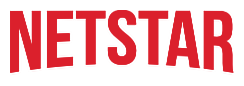

<div id="top"></div>
<!--
*** Thanks for checking out the Best-README-Template. If you have a suggestion
*** that would make this better, please fork the repo and create a pull request
*** or simply open an issue with the tag "enhancement".
*** Don't forget to give the project a star!
*** Thanks again! Now go create something AMAZING! :D
*** template from https://raw.githubusercontent.com/othneildrew/Best-README-Template/master/README.md
-->


<!-- PROJECT LOGO -->
<br />
<div align="center">
  <a href="https://github.com/1337devjb/netstar">
    
  </a>

  <h3 align="center">Netstar</h3>

  <p align="center">
    Code Challenge by Mercedes Benz Tech Innovation GmbH
    <br />
    <br />
    <br />
    <a href="https://github.com/1337devjb/netstar">View Demo</a>
    ·
    <a href="https://github.com/1337devjb/netstar/issues">Report Bug</a>
    ·
    <a href="https://github.com/1337devjb/netstar/issues">Request Feature</a>
  </p>
</div>


<!-- TABLE OF CONTENTS -->
<details>
  <summary>Table of Contents</summary>
  <ol>
    <li>
      <a href="#about-the-project">About The Project</a>
      <ul>
        <li><a href="#built-with">Built With</a></li>
      </ul>
    </li>
    <li>
      <a href="#getting-started">Getting Started</a>
      <ul>
        <li><a href="#prerequisites">Prerequisites</a></li>
        <li><a href="#installation">Installation</a></li>
      </ul>
    </li>
    <li><a href="#usage">Usage</a></li>
    <li><a href="#contributing">Contributing</a></li>
    <li><a href="#license">License</a></li>
    <li><a href="#contact">Contact</a></li>
  </ol>
</details>


<!-- ABOUT THE PROJECT -->
## About The Project

[![Product Name Screen Shot][product-screenshot]](https://example.com)

The goal of this PoC is to search and find tv shows from [https://developers.themoviedb.org](https://developers.themoviedb.org)

<p>

This POC shall simulate the user ui interaction and data flow via a command line tool.
When the cli tool is started, the user is asked for a tv series title (free text),
After the user enters a title and presses enter a list of matched series is shown.
The user has to pick a series title from that result list. In the next step the user has choose
from a season and an episode.
In the end the user gets displayed a title and a summary of the chosen episode.

</p>

<p align="right">(<a href="#top">back to top</a>)</p>


### Built With

* [Go](https://go.dev)
* [Bulma](https://bulma.io/)
* [JQuery](https://jquery.com)

<p align="right">(<a href="#top">back to top</a>)</p>


<!-- GETTING STARTED -->
## Getting Started

To get a local copy up and running follow these simple example steps.

### Prerequisites

install [Go](https://go.dev/doc/install) and you're ready to Go 😊.


### Installation

1. Get a free API Key at [https://developers.themoviedb.org/3/getting-started/introduction](https://developers.themoviedb.org/3/getting-started/introduction)
2. Clone the repo
   ```sh
   git clone https://github.com/1337devjb/netstar
   ```
3. Create .env
   ```sh
   PORT=3000
   API_KEY=YOUR_API_KEY_FROM_THEMOVIEDB
   LANGUAGE=de-DE
   INCLUDE_ADULT=True
   ```
4. Start Server
   ```sh
   air
   ```
5. Start Server with docker
  ```sh
  docker build -t my-go-app .
  docker run -d -p 3000 my-go-app
  ```

<p align="right">(<a href="#top">back to top</a>)</p>


<!-- CONTRIBUTING -->
## Contributing

Contributions are what make the open source community such an amazing place to learn, inspire, and create. Any contributions you make are **greatly appreciated**.

If you have a suggestion that would make this better, please fork the repo and create a pull request. You can also simply open an issue with the tag "enhancement".
Don't forget to give the project a star! Thanks again!

1. Fork the Project
2. Create your Feature Branch (`git checkout -b feature/AmazingFeature`)
3. Commit your Changes (`git commit -m 'Add some AmazingFeature'`)
4. Push to the Branch (`git push origin feature/AmazingFeature`)
5. Run Tests
```
go test ./... -coverprofile=coverage.out
go tool cover -html=coverage.out
```
6. Open a Pull Request

<p align="right">(<a href="#top">back to top</a>)</p>


<!-- LICENSE -->
## License

Distributed under the MIT License. See `LICENSE.txt` for more information.

<p align="right">(<a href="#top">back to top</a>)</p>


<!-- CONTACT -->
## Contact

Julian Bereth - [@your_twitter](https://twitter.com/your_username) - julian@bereths.com

Project Link: [https://github.com/1337devjb/netstar](https://github.com/1337devjb/netstar)

<p align="right">(<a href="#top">back to top</a>)</p>


[product-screenshot]: images/screenshot.png